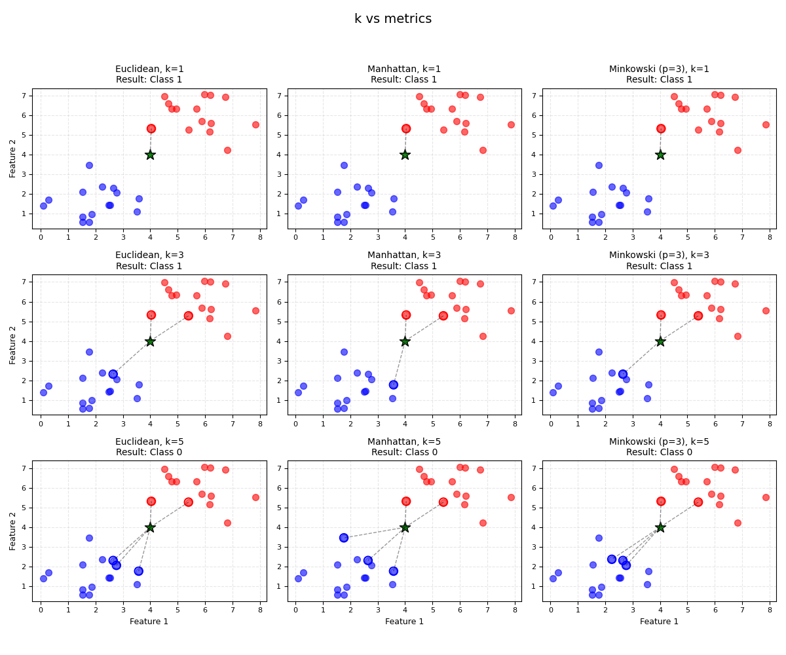

# K-Nearest Neighbors

Implementation of k-NN algorithm in Python. 

This project is designed to demonstrate the distance-based classification. It includes a custom visualization to inspect how different values of $k$ and different distance metrics impact decision boundaries.

## Formulas

The core of the k-NN algorithm relies on calculating the distance between a new point $x$ and existing training points $y$ in an $n$-dimensional space. This implementation supports three specific metrics:

### 1. Euclidean Distance
The standard straight-line distance, derived from the Pythagorean theorem. This is the default metric used in most geometric problems.

$$
d(x, y) = \sqrt{\sum_{i=1}^{n} (x_i - y_i)^2}
$$

### 2. Manhattan Distance
Also known as $L_1$ distance or "Taxicab geometry." It represents the distance traveled if movement is restricted to a grid (sum of absolute differences).

$$
d(x, y) = \sum_{i=1}^{n} |x_i - y_i|
$$

### 3. Minkowski Distance
A generalized distance metric. The parameter $p$ determines the geometry of the space:
* $p=1 \rightarrow$ Manhattan Distance
* $p=2 \rightarrow$ Euclidean Distance
* This code allows for arbitrary $p$ (e.g., $p=3$).

$$
d(x, y) = \left(\sum_{i=1}^{n} |x_i - y_i|^p\right)^{\frac{1}{p}}
$$

### 4. Classification (Distance-Weighted Voting)

Unlike standard k-NN (which uses a simple majority vote), this implementation uses **Inverse Distance Weighting**. Neighbors that are closer to the query point have a stronger influence on the prediction than those further away.

1. **Calculate Weight:** For each of the $k$ nearest neighbors, a weight $w_i$ is calculated based on its distance $d_i$:

$$
w_i = \frac{1}{d_i + \epsilon}
$$

2. **Sum Weights:** The weights are summed for each unique class:

3. **Predict:** The class with the highest total score is selected:

## Installation

You need Python installed along with `numpy` and `matplotlib`.

```bash
pip install numpy matplotlib
```

## Results


